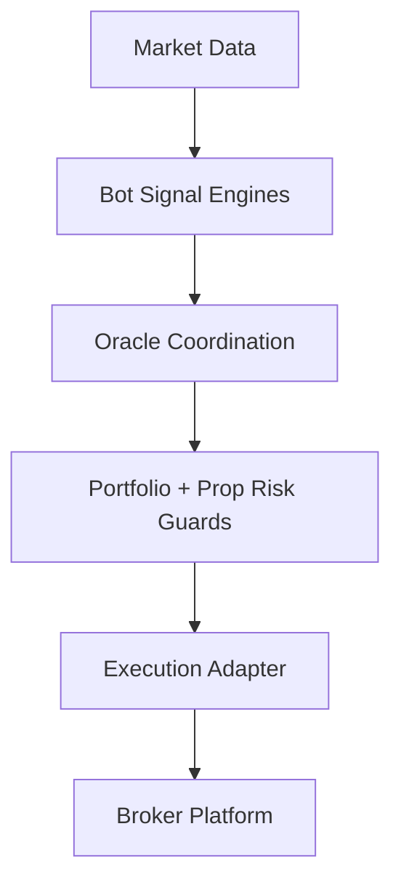

# Architecture

Ouroboros Snake Strategy is built around a simple principle:

multiple specialized execution bots generate opportunities, and Oracle turns them into coordinated portfolio behavior.

## Core Layers

## Included Layers

- snake execution bots
- Oracle coordination
- shared indicators and feature modules
- portfolio-level risk guards
- prop-firm-aware controls

## Design Priorities

- keep the ensemble identity clear
- keep coordination separate from individual trigger logic
- keep risk policy centralized
- keep broker-specific code isolated over time
